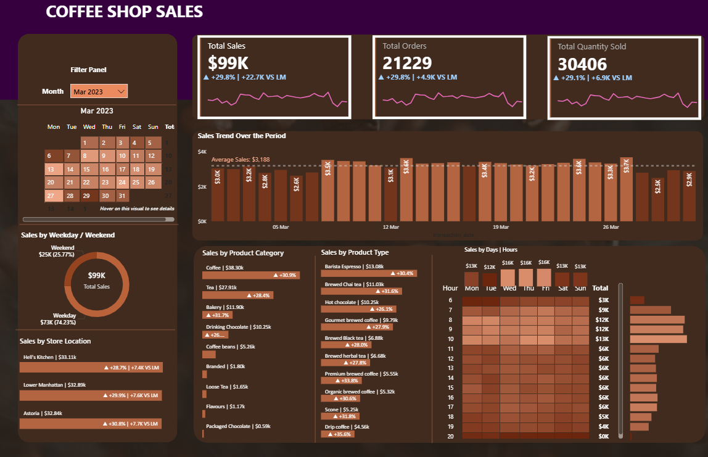
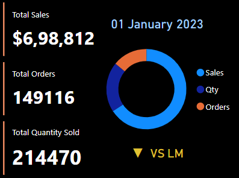

# ☕ Coffee Shop Sales Dashboard (Power BI)

## 📌 Project Overview
This project is an interactive **Power BI dashboard** designed to analyze **coffee shop sales performance** across products, time periods, and store locations.

The dashboard focuses on **sales KPIs, trend analysis, product performance, and customer purchasing behavior**, enabling business users to make **data-driven decisions**.

---

## 📊 Key KPIs
- **Total Sales**: `$13K`
- **Total Orders**: `2,816`
- **Total Quantity Sold**: `4,111`
- **Month-over-Month Growth**: ~`18%` vs Last Month

---

## 📷 Dashboard Preview

### 🔹 Overall Sales Performance

### 🔹 KPI Summary View

> 📌 *Screenshots are provided for quick review.  
> The full interactive dashboard is available via the `.pbix` file.*

---

## 📈 Insights Highlighted
- Sales trends over the selected month with average benchmarks
- Top-performing product categories and product types
- Store-wise sales comparison and MoM growth
- Peak sales hours and daily demand patterns
- Weekday vs weekend sales distribution

---

## 🧩 Data & Modeling
- Transaction-level coffee shop sales data
- Measures created using **DAX**
- Data cleaned and transformed using **Power Query**
- Time-based analysis by **day, date, and hour**

---

## 🛠 Tools & Technologies
- **Power BI Desktop**
- **DAX (Data Analysis Expressions)**
- **Power Query**
- **Data Visualization & KPI Design**

---

## 📂 Repository Structure
Coffee-Shop-Sales-PowerBI/
│── Alok Coffee Dashboard.pbix
│── screenshots/
│ ├── overview.png
│ └── kpi-summary.png
│── README.md

---

## 🚀 How to Use
1. Download or clone this repository
2. Open `Alok Coffee Dashboard.pbix` in **Power BI Desktop**
3. Interact with slicers and filters to explore insights

---

## 🔮 Future Improvements
- Publish dashboard to **Power BI Service**
- Enable **forecasting & trend analysis**
- Convert to **Power BI Project (.pbip)** for version control
- Add Row-Level Security (RLS)

---

## 👤 Author
**Alok Walunj**  
📊 Data Analyst | Data Visualization & Business Insights

---

## ⭐ Portfolio Value
This project demonstrates:
- Business-focused KPI design
- Sales analytics & trend interpretation
- Clean Power BI visuals
- Practical dashboard storytelling
